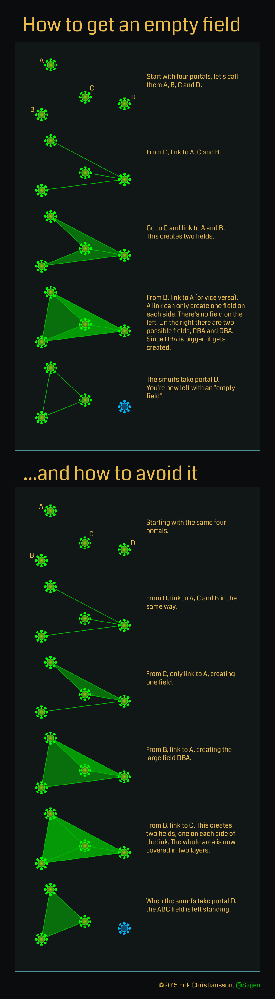

# Ingress
Notes to the game. Rest to be found on [Ingress wiki](https://ingress.fandom.com/wiki/Ingress_Prime) ✍️

## Fielding
#### Max links L portals
8 outgoing links per portal, incoming links are unlimited.
### Layering:
Get more MU per area, make them harder to destroy.
#### Rules
* One link creates only (!!!) one field (the bigger one) on each side. Rule of 👍: links should create fields 
immediately should be avoided. 
* Fields don't layer automatically; inner fields to be created first. Avoid the empty fields.  

#### Patterns ([youtube](https://www.youtube.com/watch?v=FkHtelZxgtg))
##### Cluster of smallest fields 
* simple but not layered; 
* attack can result in null fields
##### Herring bone (pyramid)
* As rule of :+1: shoot to base first to cover all with outer field, spine after (creating two side fields)
* defend the base
##### Multiple herring:
* shared bases

##### Cobweb:
* hard to build but without a single point of failure

## Mods - hacking
#### Heat sink:
* reduce the default 5 min cooldown time (per agent) 
* reset the cooldown timer and burnout hack counts to zero, allowing you to hack the portal again immediately after a heat sink is installed.
*Common: -20% Rare: -50% Very Rare: -70%*

#### Multi hack
* increase the number of hacks before burnout (default max 4 times in 4 hours), but do not reset the cooldown timer or 
burnout 
hack count like heat sinks do.  
*Common: +4 hacks Rare: +8 hacks Very Rare: +12 hacks*

